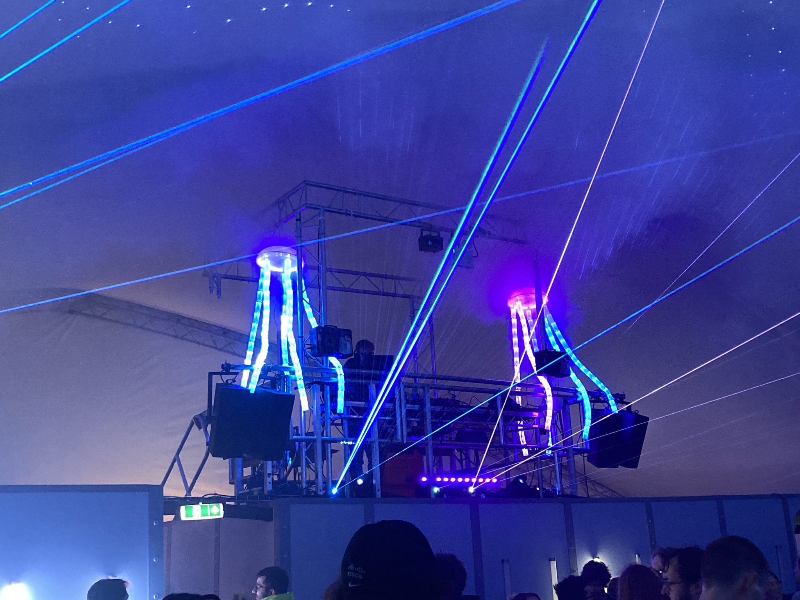

# cyberjelly
Driver code for the EMF 2022 Null Sector CyberJellies

Credit to Chris / elsmorian for the overall hardware design and PCBs, and to
the many people who helped actually build the things.

Requires the `adafruit-circuitpython-raspberry_pi_pico-en_GB-7.3.0.uf2`
firmware be loaded onto the Raspberry Pi Pico before the Python code.  After
this, the CircuitPython LED Animation library must be copied into the `lib`
directory on the Pico along with `code.py`, `hsv.py`, and `neopio.py`.

The `mini_jellies` directory contains designs for a miniature version of the
jellyfish.  The head is made from laser-cut 2mm acrylic and half of a 16cm
clear Christmas bauble.  Each tentacle is a 50cm length of 60LED/m WS2812b LED
strip.  The `code.py` file in the `mini_jellies` directory contains modified
firmware for the miniature jellies.
